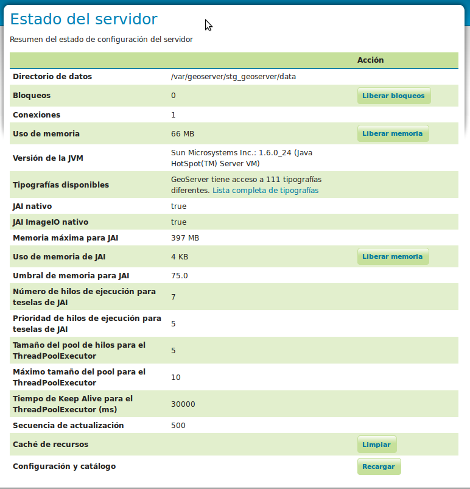
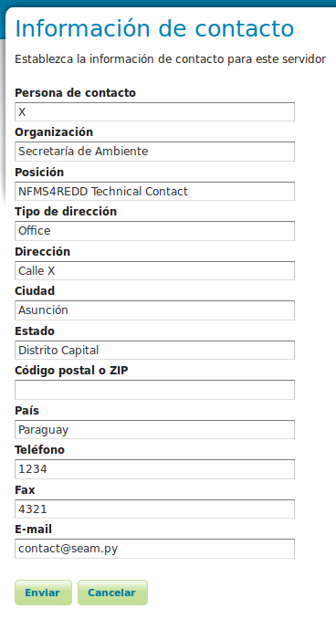

Introducción a GeoServer
==============================

.. note::

	================  ================================================
	Fecha              Autores
	================  ================================================             
	1 Diciembre 2012    * Oscar Fonts (oscar.fonts@geomati.co) 
	================  ================================================	

	©2013 FAO Forestry 
	
	Excepto donde quede reflejado de otra manera, la presente documentación se halla bajo licencia : Creative Commons (Creative Commons - Attribution - Share Alike: http://creativecommons.org/licenses/by-sa/3.0/deed.es)

La interfaz web de administración de GeoServer está accesible en:

  http://localhost/geoserver/

Nótese que es posible acceder remotamente a dicha interfaz, de tal manera que si la dirección de la máquina es por ejemplo *172.16.250.131*, es
posible acceder desde cualquier otra máquina::

	http://172.16.250.131/geoserver/

Para poder cambiar la configuración, es necesario identificarse con el usuario **admin** y contraseña **geoserver**.

La columna de la izquerda reune los enlaces hacia todas las páginas de configuración. 

En este apartado veremos brevemente la primera sección, **Servidor**.

Estado del Servidor
-------------------

El directorio de datos
......................

La información más importante de esta primera página es el **directorio de datos**, técnicamente conocido como `GEOSERVER_DATA_DIR`. Indica el directorio donde se almacenará toda la información relativa a la configuración de GeoServer. Por tanto, es una localización de la que convendrá realizar copias de seguridad.

En nuestro caso, el directorio de datos es :file:`/var/geoserver/data`.

Máquina Java y JAI nativo
.........................

Para un óptimo rendimiento de GeoServer, es recomendable utilizar la máquina virtual de java de Oracle 1.6, e instalar las librerías nativas JAI y JAI ImageIO.

Los detalles sobre la instalación de GeoServer quedan fuera del alcance de esta guía. En caso necesario, se pueden consultar en la `documentación técnica de referencia de la plataforma <http://nfms4redd.org/doc/html/>`_, y en la `documentación oficial de GeoServer <http://docs.geoserver.org/stable/en/user/>`_.

Logs de GeoServer
-----------------

El ``log`` o **archivo de registro** de una aplicación es un fichero de texto donde se van almacenando detalles sobre la ejecución del mismo. Así, un archivo de ``log`` guarda un histórico con el detalle de las operaciones realizadas, con mayor o menor detalle. Generalmente, cuando ocurre un error de ejecución, se consulta este archivo para obtener detalles sobre las causas del mismo.

Información de Contacto
-----------------------

Esta información de contacto se utilizará en los documentos de *GetCapabilities* del servidor de mapas. Así pues, es una información que se hará pública, y que servirá a los consumidores de los geoservicios para contactar con sus responsables. Es por tanto importante rellenarla con datos significativos:

Demostración: Es posible visualizar esta información desde gvSIG al realizar la conexión al servidor cargando una capa WMS por ejemplo.

Acerca de GeoServer
-------------------

Esta es una página informativa donde se puede consultar la versión de GeoServer, así como enlaces a la web principal del proyecto, a la documentación, y al sistema de seguimiento de incidencias.

Gestión de usuarios
--------------------

TODO: verificar que está actualizado

Existe la posibilidad de cambiar la contraseña del usuario *admin*, así como de crear nuevas cuentas de usuario con permisos de administración. Sin embargo en este
punto nos centraremos únicamente en el cambio de contraseña del usuario *admin*.

Para ello, hay que seguir los siguientes pasos:

1. lo primero que hay que hacer es seleccionar la entrada "Users, Groups, Roles" del apartado de "Seguridad".

   .. image:: _static/gs_password_change0.png
	:scale: 50%

2. En la pantalla resultante hay que seleccionar *Users/Groups*.

   .. image:: _static/gs_password_change1.png

3. Y en ella pinchar sobre *admin* para poder editar su password:

   .. image:: _static/gs_password_change2.png

   .. image:: _static/gs_password_change3.png
	:scale: 40%

