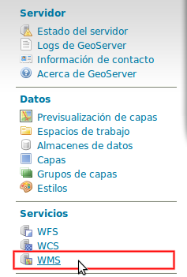

GeoServer en producción
=======================

.. note::

	================  ===================================================
	Fecha              Autores
	================  ===================================================             
	6 Feb 2014          * Víctor González (victor.gonzalez@geomati.co) 
	                    * Fernando González (fernando.gonzalez@fao.org)
	================  ===================================================	

	©2014 FAO Forestry 

	Excepto donde quede reflejado de otra manera, la presente documentación se halla bajo licencia : Creative Commons (Creative Commons - Attribution - Share Alike: http://creativecommons.org/licenses/by-sa/3.0/deed.es)

Existen varias optimizaciones a tener en cuenta para poner GeoServer en producción. Aquí tendremos en cuenta únicamente la limitación del servicio WMS y la configuración del nivel de *logging*. Para una optimización más completa se puede consultar la `documentación oficial de GeoServer <http://boundlessgeo.com/whitepaper/geoserver-production-2/#limit>`_ (en inglés). En la presente documentación asumimos que GeoServer se está ejecutando sobre el contenedor Tomcat, por lo que también veremos cómo limitar el número máximo de conexiones simultáneas en Tomcat.

Nivel de *logging*
------------------

Para realizar las optimizaciones, primero tenemos que abrir interfaz web de administración y acceder a la configuración global de GeoServer:

.. image:: _static/gs_global.png
    :align: center

Una vez allí, únicamente hay que cambiar el *Perfil de registro* a *PRODUCTION_LOGGING* y pulsar *Enviar* al final de la página:

.. image:: _static/gs_logging.png
    :align: center

También es posible cambiar la *Ubicación del registro* desde aquí, aunque se recomienda mantener la ubicación por defecto.

Limitación del servicio WMS
---------------------------

En cuanto al servicio WMS, vamos a limitar las peticiones recibidas en dos niveles. Por un lado limitaremos el tiempo y la memoria necesarios para procesar una petición de la llamada GetMap, y por otro lado el número de peticiones simultáneas que acepta el dicho servicio.

Tiempo y memoria
................

Para limitar el tiempo y la memoria requeridos por una única petición WMS en GeoServer, deberemos acceder a *WMS* en la interfaz web:

Una vez aquí, buscaremos el apartado *Límites de consumo de recursos*, donde podremos modificar tanto la memoria como el tiempo máximos de renderizado:

.. image:: _static/gs_wms_render_limits.png
    :align: center

Número de llamadas concurrentes
...............................

Por otro lado, es interesante limitar el número de peticiones simultáneas que ha de manejar GeoServer. El número recomendado de peticiones simultáneas para GeoServer es 20. 

La manera más sencilla de conseguir esto es limitar el número de peticiones en Tomcat.

Para limitar el número de peticiones simultáneas en Tomcat hay que modificar el fichero *$TOMCAT/conf/server.xml*. Aquí buscaremos el conector con el puerto 8080 y añadiremos el parámetro *maxThreads* para determinar el número máximo de peticiones::

    <Server port="8005" shutdown="SHUTDOWN">
      ...
      <Connector port="8080" protocol="HTTP/1.1"
        ConnectionTimeout="20000" redirectPort="8443"
        maxThreads="20" minSpareThreads="20" />
      ...
    </Server>

Además, también es posible controlar el número de peticiones simultáneas desde GeoServer. Para ello hay que utilizar el módulo **control-flow**, que no se encuentra instalado por defecto en GeoServer. 

Para instalarlo primero hay que descargarlo de la web de GeoServer, en la sección de descargas tras seleccionar la versión de GeoServer en el apartado *Extensiones*. El fichero comprimido que se descarga contiene otro fichero llamado *control-flow-<version>.jar* que hay que copiar en *$TOMCAT/webapps/geoserver/WEB-INF/lib*. 

Una vez instalado el módulo, para configurarlo hay que crear un fichero de configuración en *$TOMCAT/webapps/geoserver/data* con el nombre *controlflow.properties*. En dicho fichero escribiremos el siguiente contenido para limitar el número de peticiones simultáneas de imágenes para el servicio WMS::

	ows.wms.getmap=16

El número de peticiones que asignamos al servicio WMS depende del uso que se vaya a hacer de nuestro servidor. La configuración anterior de Tomcat únicamente admite 20 peticiones simultáneas en total. En el caso de que usemos el servidor principalmente para WMS podemos, como en el ejemplo, dedicar 16 al servicio WMS y dejar 4 peticiones simultáneas para cualquier otro servicio o petición a GeoServer.

En la `documentación oficial de GeoServer <http://docs.geoserver.org/stable/en/user/extensions/controlflow/index.html>`_ (en inglés) se puede encontrar mayor detalle sobre la configuración del módulo *control-flow*.
