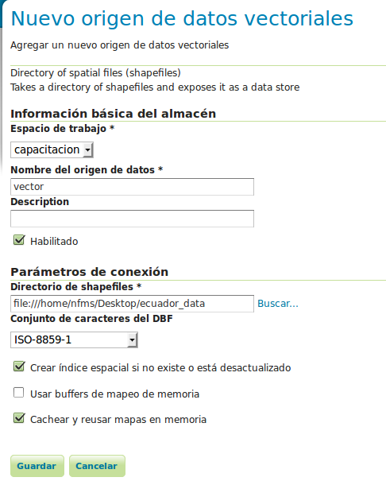
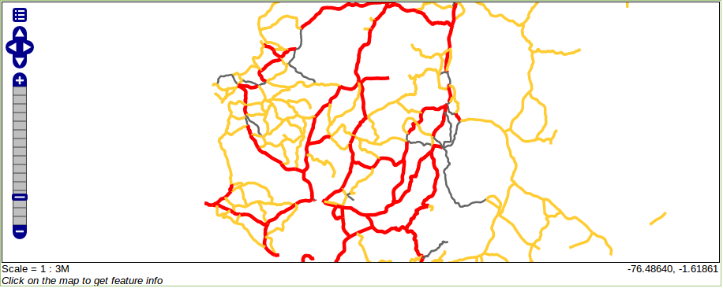

GeoServer: Publicación de datos vectoriales 
====================================================

.. note::

	=================  ================================================
	Fecha              Autores
	=================  ================================================             
	1 Diciembre 2012    * Oscar Fonts (oscar.fonts@geomati.co)
	24 Junio 2013		* Fernando González (fernando.gonzalez@fao.org)
	=================  ================================================	

	©2013 FAO Forestry 
	
	Excepto donde quede reflejado de otra manera, la presente documentación se halla bajo licencia : Creative Commons (Creative Commons - Attribution - Share Alike: http://creativecommons.org/licenses/by-sa/3.0/deed.es)

La publicación de datos se realiza a partir de los enlaces bajo el apartado **Datos**.

Creación de un espacio de trabajo
---------------------------------

Un espacio de trabajo es un contenedor para agrupar datos publicados. Por ejemplo, resulta útil para clasificar los datos publicados en 
diversas áreas temáticas. Vamos a crear un espacio de trabajo bajo el que publicar todos los datos del taller.

* En la página "Espacios de trabajo", hacer clic en "crear un nuevo espacio de trabajo".

Simplemente hay que introducir el nombre del espacio de trabajo, y un identificador URI. En nuestro caso, el URI puede ser cualquiera, pero
debe ser un identificador único universal.

* Utilizaremos **capacitacion** como nombre, y **http://nfms4redd.org/capacitacion_[nombre]_[fecha]** como espacio de nombres (reemplazando [nombre] y [fecha]).

Una vez creado, nos debe aparecer en la lista de espacios de trabajo disponibles:

.. image:: _static/gs_workspace_capacitacion.png

Creación de un almacén de datos
-------------------------------

Una vez creado el espacio de trabajo, es posible crear capas en él. Sin embargo, GeoServer distingue dos conceptos relacionados con las capas: los almacenes de datos y las capas. El primer concepto representa la forma de encontrar los datos de la capa, datos de conexión a la base de datos, ruta en el sistema operativo donde se encuentran los ficheros, etc. El segundo concepto en cambio, contiene la información para la visualización: simbología, extensión de la capa, etc. Así pues, primeramente hay que crear un almacén de datos.

Un almacén de datos contiene la información necesaria para acceder a un determinado tipo de datos geográficos. En función del
tipo de datos, será necesario crear un tipo de almacén distinto.

* En la página "Almacenes de datos", hacer clic en "Agregar nuevo almacén".

Aparece una lista de origenes de datos, separados en dos grandes bloques "Origenes de datos vectoriales" y 
"Origenes de datos raster". Aquí debemos escoger en función del tipo de datos que queremos acceder. Durante el taller utilizaremos
los almacenes de tipo "Directory of spatial files (shapefiles)", "PostGIS", "GeoTIFF" e " ImageMosaic". Como vemos, también se
puede conectar a servicios "WMS" y "WFS" remotos.

Para este ejercicio publicaremos una serie de *shapefiles*:

* Clicar en "Directory of spatial files (shapefiles)"
* Escoger **unredd** como espacio de trabajo
* Asignar el nombre **vector** al almacén de datos.
* También podemos añadir una descripción.

El dato más importante a introducir es el directorio donde están alojados los **shapefiles**.

* Hacer clic en el enlace "Buscar..." en "Directorio de Shapefiles", y navegar al directorio de datos vectoriales.

* Hacer clic en "Guardar".

Publicación de capas vectoriales
--------------------------------

Tras la creación del almacén, GeoServer pasa automáticamente a la pantalla de publicación de capas, donde obtenemos una lista
con las capas del almacén de datos recién creado que se pueden publicar y que, en este caso, se corresponden con los distintos
shapefiles en el directorio. Publicaremos estas capas una a una.

* Clicar en "publicación" una a una en las capas que se quieren publicar.

Podemos escoger un nombre, título, resumen y palabras clave para describir mejor los datos a publicar.

Por ahora, nos centraremos en los campos "Sistema de referencia de coordenadas" y "Encuadres":

.. image:: _static/gs_new_layer.png

Sistema de referencia de coordenadas
....................................

En general, GeoServer tratará de leer el sistema de referencia en que están expresados los datos de forma automática. En ocasiones, GeoServer no puede identificarlo, y hay que declararlo manualmente, como en este caso.

Sabemos que los datos para todos los ficheros "shapefile" están espresados en el sistema de referencia **EPSG:4326**.

* En "SRS Declarado", clicar en "Buscar...", introducir "4326", y aplicar este SRS.

Encuadres
.........

A continuación, hemos de declarar el ámbito geográfico cubierto por esta capa. Para datos que no vayan a cambiar su extensión en el futuro, se pueden calcular automáticamente a partir de los datos:

* Bajo "Encuadres", Clicar en "Calcular desde los datos" y "Calcular desde el encuadre nativo".

* Finalmente, clicar en "Guardar" para publicar la nueva capa "country".

Publicación del resto de capas
..............................

Usando el mismo procedimiento, publicaremos las otras capas del almacén:

* Clicar en "Agregar nuevo recurso" dentro de la página "Capas", y seleccionando el almacén **capacitacion:vector**.

* Repetir los pasos descritos anteriormente para cada capa.

.. note:: Para saber más...

   * Documentación técnica NFMS: `GeoServer > Adding Data to Geoserver > Adding Base Types <http://nfms4redd.org/doc/html/geoserver/adding_data/adding_base_types.html>`_

Previsualización de capas
-------------------------

Desde la página "Previsualización de capas", podemos acceder a los datos recién publicados en diversos formatos.

.. image:: _static/gs_layer_preview.png

* Visualizar las nuevas capas utilizando el enlace "OpenLayers".

Observamos que las capas poligonales están simbolizadas en gris, mientras que las capas lineales aparecen azules. Estas son las simbolizaciones o **estilos** que GeoServer aplica por defecto. En el siguiente apartado veremos cómo crear nuestra propia simbolización.

.. image:: _static/gs_layer_preview_ol.png

Desde la página "Previsualización de capas" tambien tenemos acceso a los datos en muchos otros formatos, como KML, para visualizar sobre Google Earth.

Simbolización de capas vectoriales
----------------------------------

Para agregar nuevos estilos, acceder a la página "Estilos", y clicar en "Agregar un nuevo estilo".

Los estilos se definen utilizando el formato XML estándar llamado SLD (*Styled Layer Descriptor*). Es un formato bastante prolijo, con multitud de elementos, que iremos descubriendo paso a paso. Generalmente se parte de un ejemplo ya existente, y se adapta a nuestras necesidades.

A continuación, una plantilla básica de SLD:

.. code-block:: xml

    <?xml version="1.0" encoding="ISO-8859-1"?>
    <StyledLayerDescriptor version="1.0.0"
        xsi:schemaLocation="http://www.opengis.net/sld StyledLayerDescriptor.xsd"
        xmlns="http://www.opengis.net/sld"
        xmlns:ogc="http://www.opengis.net/ogc"
        xmlns:xlink="http://www.w3.org/1999/xlink"
        xmlns:xsi="http://www.w3.org/2001/XMLSchema-instance">
      <NamedLayer>
        <Name>...nombre del estilo...</Name>
        <UserStyle>
          <FeatureTypeStyle>
            <Rule>...regla de simbolización 1...</Rule>
            <Rule>...regla de simbolización 2...</Rule>
          </FeatureTypeStyle>
        </UserStyle>
      </NamedLayer>
    </StyledLayerDescriptor>

A partir de esta plantilla, daremos un nombre al estilo, y añadiremos una o más reglas de simbolización.

Estilo para límites administrativos: Linea básica
.......................................................

Para los límites administrativos, utilizaremos una línea de color ocre, codificado como ``#f0a020``, y de grosor 1 píxel.

.. note:: `Utilidad en línea para generar códigos de colores <http://html-color-codes.info/codigos-de-colores-hexadecimales/>`_

Así, la regla de simbolización se aplicará sobre los elementos lineales (``LineSymbolizer``), sobre los que definiremos dos parámetros para el trazo: ``stroke`` y ``stroke-width``.

* A partir de la plantilla anterior, incluir la siguente regla de simbolización:

.. code-block:: xml

  <Rule>
    <LineSymbolizer>
      <Stroke>
        <CssParameter name="stroke">#f0a020</CssParameter>
        <CssParameter name="stroke-width">1</CssParameter>
      </Stroke>
    </LineSymbolizer>
  </Rule>

**Importante**: Antes de "Enviar" el estilo, es conveniente "Validar", para asegurarse que la sintaxis es la correcta, y evitar errores al aplicar el estilo a la capa.

A continuación, asignaremos este nuevo estilo a la capa.

* Desde la página "capas", seleccionar la capa a la que queremos aplicar el estilo.
* En la pestaña "Publicación", bajo "Configuración WMS", cambiar el estilo por defecto y seleccionar el estilo que acabamos de crear. 
  Aparecerá una pequeña leyenda: |regions_legend|.
* Guardar los cambios.

.. |regions_legend| image:: _static/gs_legend_line.png

Ahora, al previsualizar la capa obtendremos la nueva simbolización.

Múltiples simbolizadores: Etiquetado
...............................................

Siguiendo los pasos anteriormente descritos, crearemos un nuevo estilo para una capa puntual.

En esta ocasión, simbolizaremos con un triángulo cada uno de los puntos de la capa y, adicionalmente, añadiremos una
etiqueta con el nombre del punto, para lo cual utilizaremos dos simbolizadores: *PointSymbolizer* y *TextSymbolizer*.

Esta es la regla que debe aplicarse:

.. code-block:: xml

    <Rule>
      <PointSymbolizer>
        <Graphic>
          <Mark>
            <WellKnownName>triangle</WellKnownName>
            <Fill>
              <CssParameter name="fill">#FF0000</CssParameter>
            </Fill>
          </Mark>
          <Size>6</Size>
        </Graphic>
      </PointSymbolizer>
      <TextSymbolizer>
        <Label>
          <ogc:PropertyName>Id</ogc:PropertyName>
        </Label>
        <Fill>
          <CssParameter name="fill">#000000</CssParameter>
        </Fill>
      </TextSymbolizer>
    </Rule>

* Crear el nuevo estilo "etiquetado" aplicando los simbolizadores anteriores
* Validarlo
* Asignarlo a la capa
* Previsualizar la capa

Estilo para carreteras: Filtros
...............................

Para la capa de carreteras vamos a utilizar varias reglas de simbolización, dependiendo del valor del atributo ``RTT_DESCRI``.

* Crear un nuevo estilo "roads", con una simbolización de color rojo "#FF0000" y un grosor de línea de 4 píxeles.
* Añadir el siguiente filtro, justo antes del ``LineSymbolizer``:

.. code-block:: xml

  <ogc:Filter>
    <ogc:PropertyIsEqualTo>
      <ogc:PropertyName>RTT_DESCRI</ogc:PropertyName>
      <ogc:Literal>Primary Route</ogc:Literal>
    </ogc:PropertyIsEqualTo>
  </ogc:Filter>

De este modo, la regla de simbolización sólo se aplicará sobre las líneas con ``RTT_DESCRI`` igual a ``Primary Route``.

* Aplicar el nuevo estilo a la capa "roads", y previsualizar la capa.

Deberán mostrarse sólamente algunas de las carreteras, de color rojo.

A continuación, vamos a aplicar otras dos reglas, a otros dos tipos de carreteras:

* Volver a editar el estilo "roads".
* Copiar la regla de simbolización (``rule``) y pegar dos veces. Obtendremos tres reglas idénticas.
* Editar la segunda regla:

  * Cambiar el filtro para que coincida con las líneas con ``RTT_DESCRI`` igual a ``Secondary Route``.
  * Cambiar el simbolizador para que utilice un color amarillo ``#FFCC33`` y un grosor de línea de 3 píxeles.
* Editar la tercera regla:
  * Cambiar el filtro para que coincida con las líneas con ``RTT_DESCRI`` igual a ``Unknown``.
  * Cambiar el simbolizador para que utilice un color gris ``#666666`` y un grosor de línea de 2 píxeles.

* Validar el nuevo estilo, aplicar y previsualizar la capa "roads" de nuevo. Debería presentar un aspecto como este:

.. note:: Para saber más...

   * Documentación técnica NFMS: `GeoServer > Pretty Maps with GeoServer > Styling with SLD <http://nfms4redd.org/doc/html/geoserver/pretty_maps/styling.html>`_
   * Manual de Usuario de GeoServer: `Styling <http://docs.geoserver.org/stable/en/user/styling/index.html>`_
