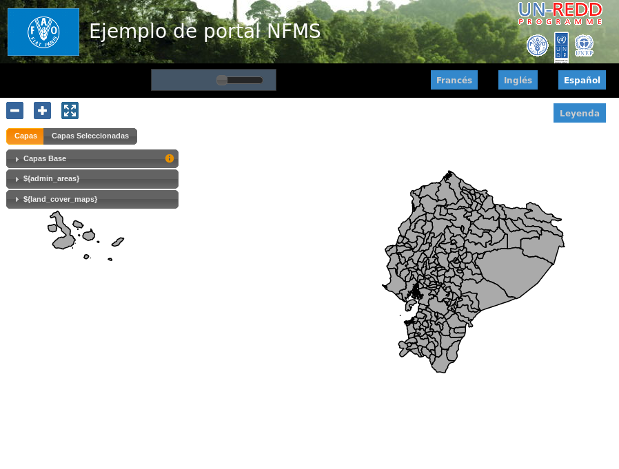
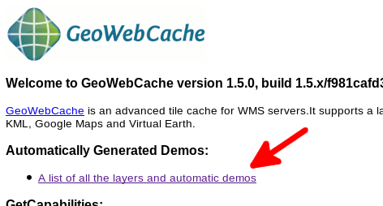
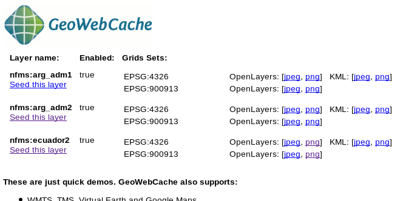
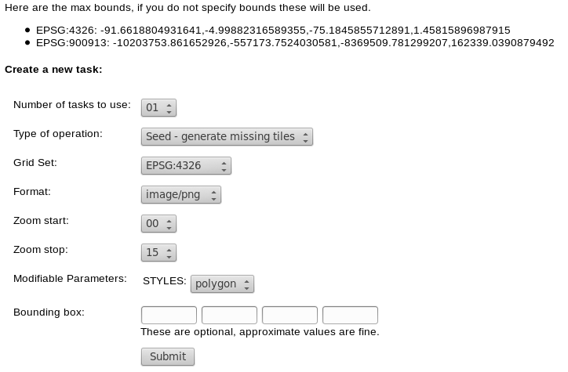
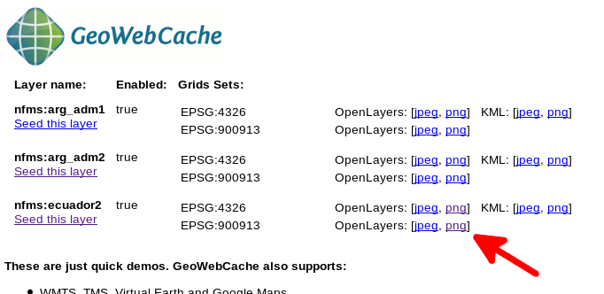
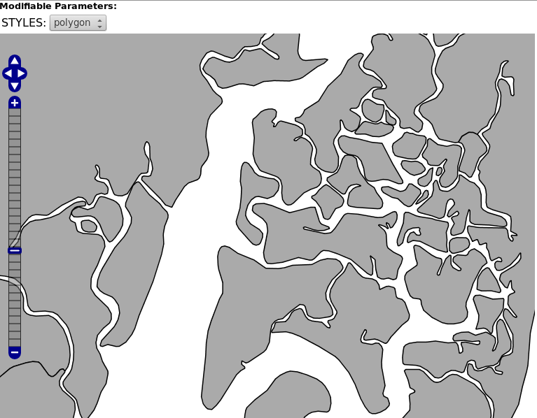
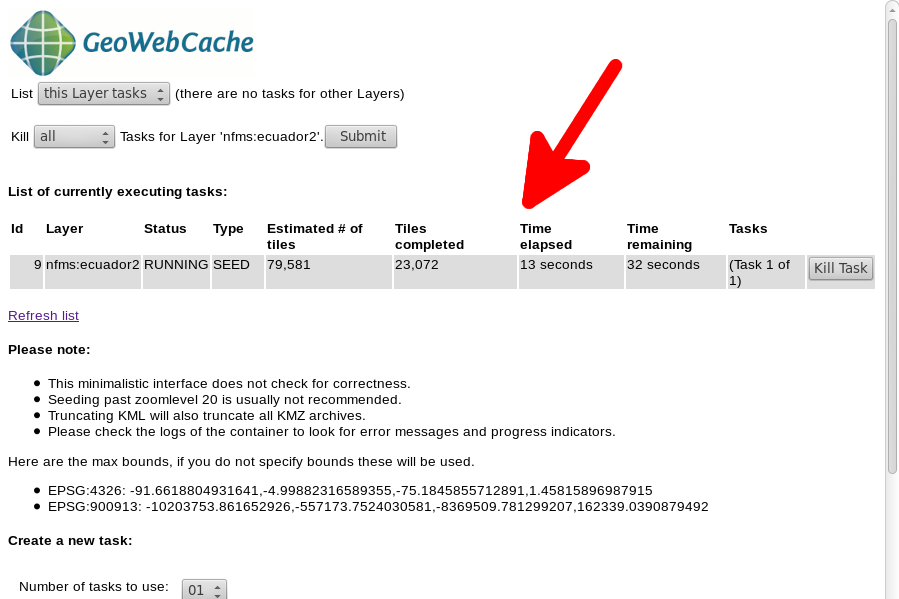
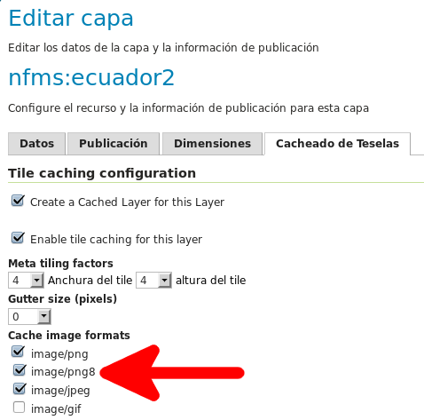

Pregeneración de teselas en GeoWebCache
==================================================

.. note::

	=================  ================================================
	Fecha              Autores
	=================  ================================================             
	20 Enero 2014		* Fernando González (fernando.gonzalez@fao.org)
	=================  ================================================	

	©2013 FAO Forestry 
	
	Excepto donde quede reflejado de otra manera, la presente documentación se halla bajo licencia : Creative Commons (Creative Commons - Attribution - Share Alike: http://creativecommons.org/licenses/by-sa/3.0/deed.es)

Pregeneración de teselas
-------------------------

Hay dos maneras de generar las teselas de GeoWebCache. La primera forma consiste en generar progresivamente mientras se visualiza el mapa. En este caso, las teselas se almacenan en caché a medida que son solicitadas a través de la navegación por mapa (por ejemplo, en OpenLayers). La primera vez que se solicita una tesela, esta se servirá a la misma velocidad que en el caso de una solicitud WMS estándar, ya que ésta se ha de generar y guardar en la caché. La veces siguientes, la tesela ya estará generada y almacenada en la caché por lo que el tiempo de respuesta de la petición será mucho menor. La principal ventaja de este método es que no requiere ningún procesamiento previo y que sólo los datos que ha solicitado se almacenan en caché, ahorrando potencialmente espacio en disco. La desventaja de este método es que el mapa se visualiza con velocidad muy variable, lo que reduce la calidad de la experiencia del usuario.

La otra forma de rellenar la caché es mediante pregeneración. La pregeneración es el proceso en el que se generan y almacenan en caché todas las teselas deseadas. Cuando este proceso se usa inteligentemente, la experiencia de usuario mejora en gran medida ya que las teselas se encuentran todas pregeneradas y el usuario no tiene que sufrir tiempos de espera largos. La desventaja de este proceso es que la pregeneración puede ser muy costosa en tiempo y en espacio en disco.

En la práctica se utiliza una combinación de ambos métodos, pregenerando a ciertos niveles de zoom (o en determinadas zonas de los niveles de zoom) y dejando las teselas menos utilizadas sin pregenerar.

Ejemplo: pregeneración de unidades administrativas de Ecuador
---------------------------------------------------------------

En el ejemplo que nos ocupa vamos a pregenerar las teselas para el mapa de Ecuador que se puede ver en la figura, en el sistema de referencia EPSG:900913:

Para ello tenemos que acceder a la URL ``geoserver/gwc`` dentro de nuestro servidor, por ejemplo ``http://127.0.0.1:8080/geoserver/gwc/`` si estamos accediendo desde la máquina local.

Nos aparecerá la página principal de GeoWebCache, y deberemos acceder al enlace donde se listan todas las capas:

Una vez seguido el enlace nos aparecerá una página con las capas existentes en la caché. Podemos observar cómo debajo de cada capa hay un enlace con el texto "Seed this layer", que nos permite pregenerar la caché.

Siguiendo dicho enlace llegaremos a la página que nos permite pregenerar la caché en un formulario al final de la misma:

En él podemos observar que se nos piden distintos parámetros, de los que destacamos:

* Type of operation (Tipo de operación): Generalmente seleccionaremos siempre "Seed", o sea, pregeneración.
* Grid Set: En este punto seleccionaremos el sistema de referencia de nuestro mapa.
* Formato: Muy importante seleccionar el formato de imagen que estamos usando en las llamadas de nuestro mapa al servidor. En nuestro caso image/png
* Zoom start y Zoom stop: Esto son los niveles de zoom para los cuales se generarán las teselas.
* STYLES: El estilo con el que se generarán las teselas.
* Bounding box: Extensión de nuestros datos que define las teselas que se generarán. Por defecto se toma la extensión de la capa.

Casi todas las opciones son sencillas de seleccionar. Sin embargo, para los niveles de zoom nos puede surgir una duda ¿a qué escala corresponde cada nivel de zoom?

Si bien la respuesta exacta es complicada de obtener, es bastante sencillo hacerse una idea intuitiva. Para ello tenemos que volver a la página que lista las capas y ver que a la derecha aparecen demos con OpenLayers para los distintos sistemas de referencia y para cada formato de imagen:

 
Pinchando en el que nos interesa EPSG:900913 y png podemos acceder a una página de demostración en la que aparece una barra de zoom con los niveles de GeoWebCache. Podemos navegar e identificar los niveles a los que queremos acceder, teniendo en cuenta que el más alejado corresponde con el nivel 0. Por ejemplo, la capa aparece dibujada inicialmente en el nivel de zoom 6:

.. image:: _static/nivel_zoom_6.png

Si nos movemos al nivel 12, podemos observar que tal vez sea el nivel máximo al cual queramos visualizar la imagen: 

Con lo cual ya tenemos los parámetros necesarios para pregenerar la caché. Volviendo al formulario, podemos especificar los parámetros y, tras pulsar en el botón "Submit", se iniciará una tarea que se reporta más arriba en la página:

Una vez generada, cada vez que el usuario se mueva en un mapa entre los niveles 6 y 12 de zoom se obtendrán las imágenes desde la caché, por lo que la navegación será muy rápida, mientras que a distintos niveles de zoom la velocidad decrecerá porque el servidor tendrá que dibujar las teselas.

El resultado de la caché se guarda internamente en el directorio de datos de GeoServer. Así, si dicho directorio es ``/var/geoserver/data``, la caché se almacena en ``/var/geoserver/data/gwc``, en un subdirectorio para cada capa. El resultado de la pregerenación de la caché ocupa 87Mb en el directorio ``/var/geoserver/data/gwc/nfms_ecuador2``.

En la práctica, es bastante barato generar los primeros niveles, de 0 a 6, ya que al ser escalas muy pequeñas (zooms muy lejanos), con pocas teselas se cubre rápidamente la extensión de la capa. Sin embargo, es a escalas más grandes cuando cuesta cada vez más tiempo la generación de la caché para el nivel de zoom y más espacio almacenarlo. Por ejemplo, la generación del nivel 13, nos hace pasar de 87Mb a 319Mb. Y si observamos dentro del directorio ``/var/geoserver/data/gwc/nfms_ecuador2`` podemos ver que cada nivel de zoom casi cuadriplica el tamaño del nivel anterior::

	12K 	EPSG_900913_00
	16K 	EPSG_900913_01
	24K 	EPSG_900913_02
	28K 	EPSG_900913_03
	32K 	EPSG_900913_04
	64K 	EPSG_900913_05
	104K	EPSG_900913_06
	224K	EPSG_900913_07
	608K	EPSG_900913_08
	1.8M	EPSG_900913_09
	5.2M	EPSG_900913_10
	18M 	EPSG_900913_11
	62M 	EPSG_900913_12
	233M	EPSG_900913_13

Entre las prácticas que reducen el coste temporal y espacial de la caché está la de evitar la pregeneración de zonas sin interés. En el caso de Ecuador, es obvio que a partir del nivel de zoom 7 u 8, no tiene sentido pregenerar las teselas que corresponden al agua entre Islas Galápagos y el continente. Esto se puede regular con la opción ``bounding box`` del formulario de pregeneración.

Por último, en el caso de teselas cuyo renderizado no contenga más de 256 colores, es posible utilizar el formato PNG8, que ocupa algo menos que el formato PNG, lo cual se traduce en menor espacio para almacenar las teselas de la caché así como en menor tiempo de transmisión entre el servior y el mapa cliente. Para ello, hay que habilitar dicho formato en GeoServer, yendo a la pestaña "Cacheado de Teselas" de la capa y habilitando el formato en la sección "Cache image formats":

Tras guardar los cambios, seremos capaces de seleccionar dicho formato en el formulario de pregeneración. Como comparativa, el resultado de pregenerar los niveles de 6 a 12 es 78Mb, un 10% menor que los 87Mb correspondientes al formato PNG.

.. note::

	En caso de aplicar esta optimización, hay que asegurarse de que el cliente pide las teselas en el formato ``image/png8``. 
