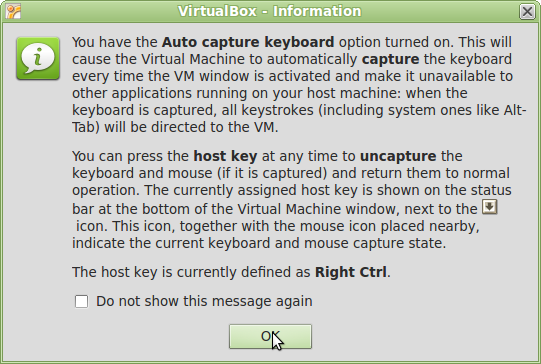

Instalación de la máquina virtual
==================================

.. note::

	=================  ================================================
	Fecha              Autores
	=================  ================================================             
	24 Junio 2013		* Fernando González (fernando.gonzalez@fao.org)
	=================  ================================================	

	©2013 FAO Forestry 
	
	Excepto donde quede reflejado de otra manera, la presente documentación se halla bajo licencia : Creative Commons (Creative Commons - Attribution - Share Alike: http://creativecommons.org/licenses/by-sa/3.0/deed.es)

La formación se va a realizar en una máquina virtual. Para ello se utilizará un software de virtualización,
que se encargará de hospedar la máquina virtual. Para el caso que nos ocupa crearemos una máquina ubuntu/linux dentro
del software de virtualización VirtualBox.

Los pasos necesarios para esto son:

* Descarga e instalación de VirtualBox.
* Creación de una máquina máquina virtual
* Instalación de ubuntu/linux

En la terminología de los software de virtualización, la máquina real es la anfitriona, *host* en inglés; mientras que la
máquina virtual es la huésped, o *guest* en inglés.

Instalación de VirtualBox
--------------------------

El primero de los pasos es descargar VirtualBox del epígrafe "VirtualBox platform packages" de la página de descargas [*]_ 
y proceder a su instalación.

Más adelante será necesario instalar Ubuntu/Linux, por lo que es recomendable realizar la descarga del programa de instalación
mientras se prepara la máquina virtual. Para ello es necesario ir a la página de descargas de Ubuntu [*]_ y descargar 
Ubuntu Desktop, preferiblemente el paquete para 32 bits de la versión 12.04 LTS (Long Term Support, soporte a largo plazo). 

La página de Ubuntu pide una pequeña contribución para la descarga, pero no es obligatorio hacerla. Es posible continuar 
hacia la descarga pinchando en el enlace "not now, take me to the download":

.. image:: _static/ubuntu_download.png 

El resultado de esta descarga debe ser un fichero con un nombre parecido a "ubuntu-12.04.1-desktop-i386.iso".

Creación de una máquina virtual
--------------------------------

Una vez VirtualBox está instalado, se deberá arrancar y crear una nueva máquina virtual:

.. image:: _static/p00.png

A continuación le damos un nombre a la máquina virtual y especificamos el sistema operativo "Linux", "Ubuntu".

.. image:: _static/p01.png

Especificamos 1024Mb de memoria para la máquina virtual. Hay que tener en cuenta que esta memoria se toma de la máquina anfitriona
por lo que si la máquina anfitriona tiene menos de 2048Mb, dar 1024Mb a la máquina virtual puede ser demasiado, ya que la anfitriona se
puede quedar sin memoria.

Como regla general, lo deseable es 1024Mb pero en ningún caso debe sobrepasarse el 50% de la memoria total de la máquina
anfitriona.

.. image:: _static/p02.png

Por último sólo queda especificar el tamaño y tipo del disco, en el que dejaremos las opciones que vienen por defecto.

.. image:: _static/p03.png

.. image:: _static/p04.png

.. image:: _static/p05.png

.. image:: _static/p06.png

Ahora la máquina está creada y puede ser arrancada seleccionándola y pulsando el botón "Start". 

.. image:: _static/p07.png

Al arrancar se ofrecen varios mensajes informativos que no son muy importantes. Uno de ellos informa sobre la "tecla anfitriona". Cuando
se está trabajando en la máquina virtual y se pulsa dicha tecla, el software de virtualización quita el foco al sistema
operativo y lo devuelve a la maquina anfitriona. La tecla por defecto es el "Control" derecho.

Instalación de Ubuntu/Linux
----------------------------

Lo siguiente que hay que hacer es instalar una versión de Ubuntu/Linux. El propio proceso de arranque de la máquina
virtual pregunta a continuación dónde puede encontrar una imagen del sistema operativo.

A continuación hay que pulsar el botón de la carpetita para seleccionar la imagen de Ubuntu que descargamos en el primer punto: ubuntu-12.04.1-desktop-i386.iso.

.. image:: _static/p09.png

Y por último sólo queda pulsar el botón *Start* para comenzar la instalación.

.. image:: _static/p10.png

Un aspecto importante es que la instalación se puede seguir en Español, seleccionándolo desde la lista de la izquierda.

.. image:: _static/p11.png

.. [*] https://www.virtualbox.org/wiki/Downloads

.. [*] http://www.ubuntu.com/download

