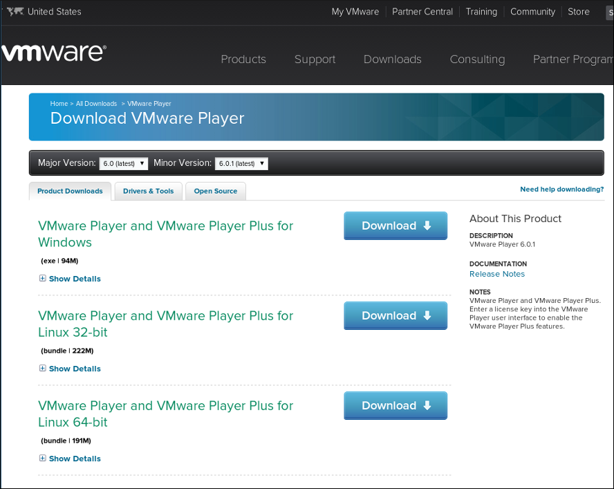
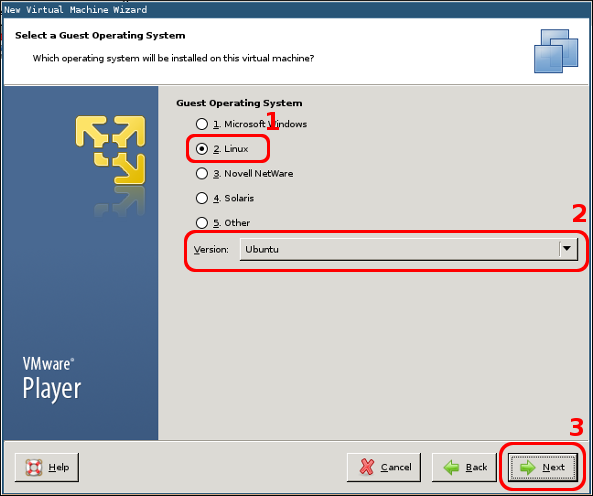
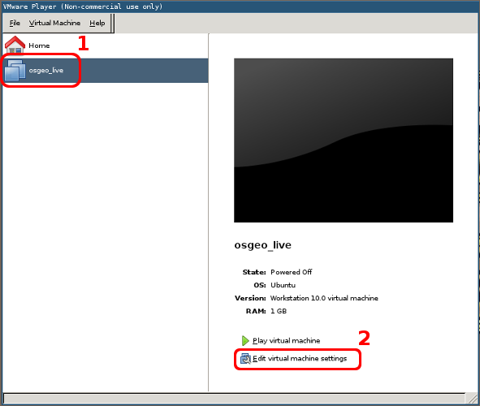
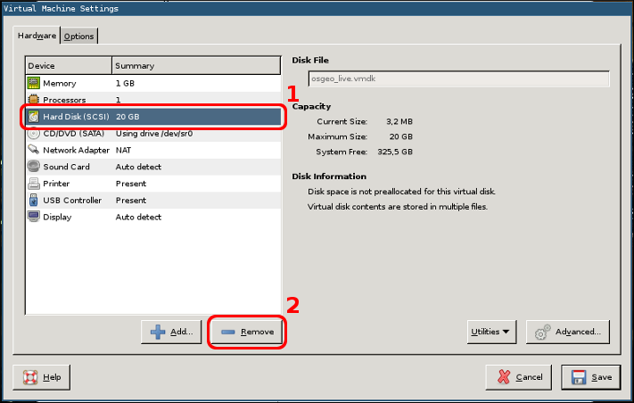
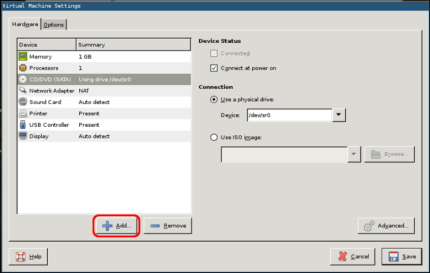
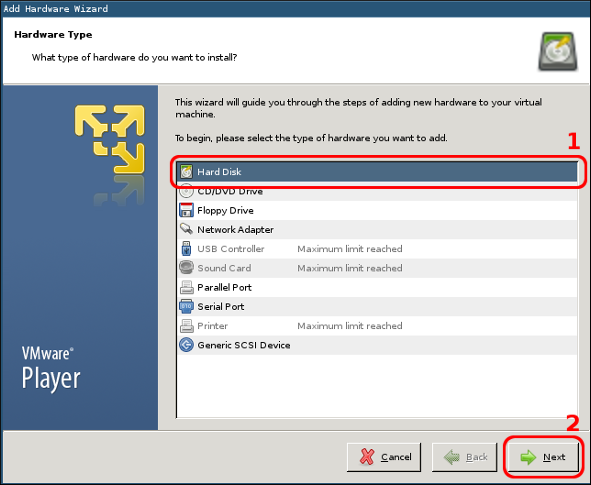
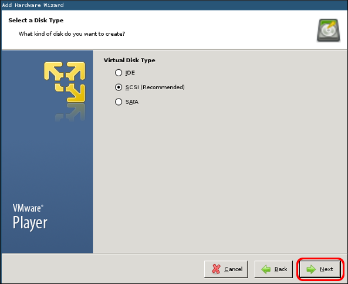
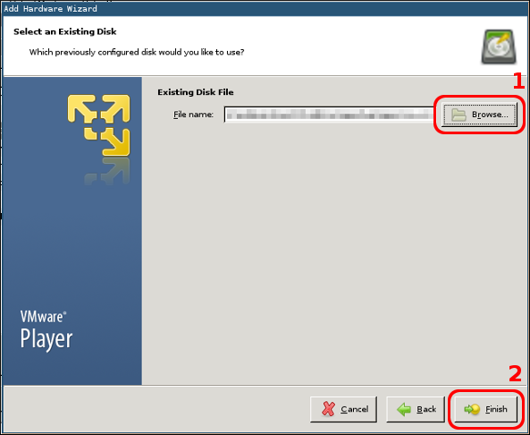
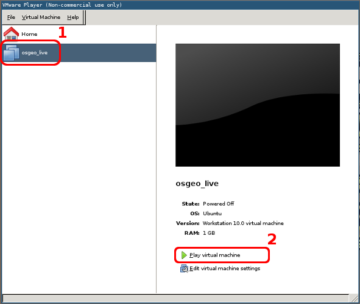

VMWare Instalación de la máquina virtual
========================================

.. note::

    +------------+-----------------------------------------+
    | Fecha      | Autor                                   |
    +------------+-----------------------------------------+
    | 2014-03-31 | * Pedro-Juan Ferrer (pferrer@osgeo.org) |
    +------------+-----------------------------------------+

    ©2014 Geoinquietos Valencia

    Excepto donde quede reflejado de otra manera, la presente documentación
    se halla bajo licencia : Creative Commons (Creative Commons -
    Attribution - Share Alike:
    http://creativecommons.org/licenses/by-sa/4.0/)
    
La formación se va a realizar en una máquina virtual. Para ello se utilizará
un software de virtualización, que se encargará de hospedar la máquina
virtual. 

Para el caso que nos ocupa emplearemos la máquina virtual |olver| de `OSGeo
Live`_ dentro del software de virtualización :program:`VMWare Player`.

Los pasos necesarios para esto son:

* Descarga e instalación de :program:`VMWare player`.
* Descarga de *OSGeo Live*.
* Configuración de la máquina virutal

En la terminología de los software de virtualización, la máquina real es la
anfitriona, *host* en inglés; mientras que la máquina virtual es la huésped, o
*guest* en inglés.

Descarga e instalación de VMWare Player
----------------------------------------

El primer paso es descargar el software de la `página de descargas de
VMWare`_ y proceder a su instalación.

El resultado de esta descarga debe ser un fichero con un nombre parecido a
:file:`VMware-Player-6.0.1-1379776.x86_64.bundle` o
:file:`VMware-player-6.0.1-1379776.exe` en función del sistema operativo
seleccionado.

Instalación en GNU/Linux (Debian)
~~~~~~~~~~~~~~~~~~~~~~~~~~~~~~~~~

Al tratarse de un archivo binario, deberán cambiarse los permisos para poder
ejecutar la instalación:

.. code-block:: bash

   $ chmod +x VMware-Player-6.0.1-1379776.x86_64.bundle

Y deberemos ejecutarlo con permisos de superusuario:

.. code-block:: bash

   $ sudo ./VMware-Player-6.0.1-1379776.x86_64.bundle

y usar las opciones por defecto para la instalación.

Instalación en Windows 
~~~~~~~~~~~~~~~~~~~~~~~~~~~~~~~~~

Ejecutaremos el archivo :file:`.exe` y usaremos las opciones por defecto para la
instalación.

.. _página de descargas de VMWare: https://my.vmware.com/web/vmware/free#desktop_end_user_computing/vmware_player/6_0

Descarga de OSGeo Live
------------------------------

Para descargar la |olver| de la máquina virtual deberemos visitar la
`sección correspondiente de la web Sourceforge`_ y proceder a la descarga
del archivo :file:`.7z` [1]_.

.. image:: _static/download_live.png

Descompresión del archivo en GNU/Linux
~~~~~~~~~~~~~~~~~~~~~~~~~~~~~~~~~~~~~~

Para descomprimir el archivo emplearemos el comando:

.. code-block:: bash

   $ 7z e osgeo-live-vm-7.0.7z

Descompresión del archivo en Windows
~~~~~~~~~~~~~~~~~~~~~~~~~~~~~~~~~~~~~~

Si hemos instalado la aplicación :program:`7-Zip File Manager` al hacer
doble click sobre el archivo descargado nos mostrará una ventana de
aplicación con la que podemos seleccionar :guilabel:`Extraer` y después
indicarle a la aplicación en qué directorio queremos descomprimir el
archivo.

.. image:: _static/vmware_proc_17.png

También es posible descomprimir el archivo usando la aplicación
:program:`WinRAR`.

Configuración de la máquina virtual
--------------------------------------

La máquina virtual se ejecuta dentro del programa :program:`VMWare Player`
que hemos instalado con anterioridad, por lo que arrancaremos dicho programa

.. image:: _static/vmware_open_vm.png

Seleccionaremos la opción :guilabel:`Create a New Virtual Machine`.

.. image:: _static/vmware_proc_01.png

Seleccionamos :guilabel:`I will install the operating system later`

Seleccionamos :guilabel:`Guest Operating System: Linux` y
:guilabel:`Version: Ubuntu`

A continuación deberemos darle un nombre a la máquina virtual y seleccionar
una ubicación en disco en la que almacenarla. 

.. image:: _static/vmware_proc_03.png

Seleccionamos el nombre de la máquina y cuál será su localización en disco. 
El nombre de la máquina *osgeo_live* y el destino de la
máquina aparece difuminado.

.. image:: _static/vmware_proc_04.png
   
La aplicación nos solicitará que seleccionemos la capacidad del disco. En
realidad no usaremos el disco que configure la máquina virtual, por lo que
podemos dejar las opciones por defecto.

Seleccionamos la configuración del disco duro: :guilabel:`Split virtual disk
into multiple files`

.. image:: _static/vmware_proc_05.png

Pulsaremos :guilabel:`Finish`

.. image:: _static/vmware_proc_06.png

Pulsaremos :guilabel:`Close`

Tenemos la máquina virtual creada pero hay que configurarla para que use el
disco que nos hemos descargado.

Seleccionamos la máquina osgeo_live y a continuación pulsamos
:guilabel:`Edit virtual machine settings`

   
Seleccionaremos el disco duro creado por defecto :guilabel:`Hard Disk
(SCSI)` y lo eliminaremos.

Seleccionar :guilabel:`Hard Disk (SCSI)` y después pulsar :guilabel:`Remove`

Ahora añadiremos el disco virtual que nos hemos descargado de *Sourceforge*
y hemos descomprimido.

Pulsar :guilabel:`Add...`

Seleccionar :guilabel:`Hard Disk` y pulsar :guilabel:`Next`

   
Dejaremos la opción por defecto :guilabel:`SCSI`

Pulsar :guilabel:`Next`

El nuevo disco ya existe por lo que hay que seleccionar la opción
:guilabel:`Use an existing virtual disk`

.. image:: _static/vmware_proc_12.png

Seleccionar :guilabel:`Use an existing virtual disk` y pulsar
:guilabel:`Next`

   
A continuación pulsaremos :guilabel:`Browse` y buscaremos el lugar dónde
hemos descomprimido el archivo descargado de *Sourceforge*. En la imagen
podemos ver que la casilla ha sido difuminada.

Seleccionar el disco que hemos descomprimido y pulsar :guilabel:`Finish`

.. image:: _static/vmware_proc_14.png
   
Es posible que la aplicación nos solicite información sobre la ejecución de
una actualización de versión del disco virtual. **La opción de convertirlo
es completamente opcional** por lo que nos podemos saltar este paso. Para
convertirlo deberemos seleccionar la opción :guilabel:`Convert`.

.. image:: _static/vmware_proc_15.png
   
Solo restará guardar la configuración de la máquina virtual pulsando
:guilabel:`Save`

Y ejecutar la máquina virtual con la opción :guilabel:`Play virtual machine`

Seleccionamos :guilabel:`osgeo_live` y pulsamos :guilabel:`Play virtual
machine`

.. [1] 7-Zip es un gestor de archivos comprimidos Open Source y
   multiplataforma que usa de manera nativa el formato de archivo :file:`7z`
   aunque puede trabajar con muchos otros. Puede instalarse por paquetes o
   descargarse de http://www.7-zip.org

.. |olver| replace:: versión 7.0

.. _OSGeo Live: http://live.osgeo.org
.. _sección correspondiente de la web Sourceforge: http://sourceforge.net/projects/osgeo-live/files/7.0/

